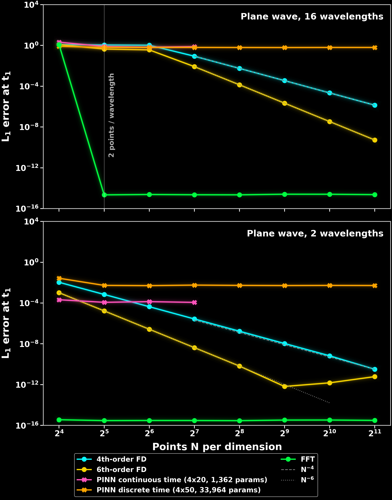
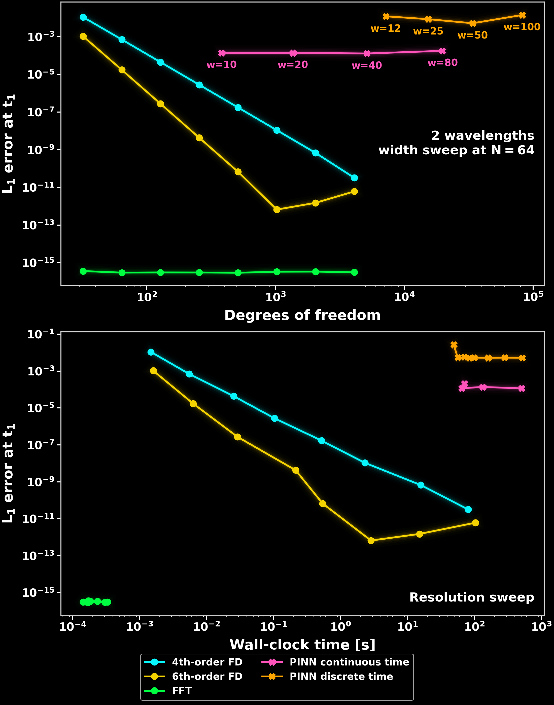
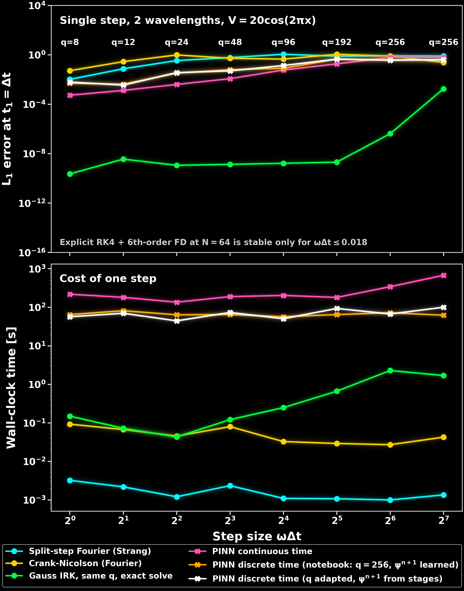

# Solve the linear Schrödinger equation in 1D using a Physics Informed Neural Network


This code heavily draws on the implementation of the PINN approach published by Jan Blechschmidt under https://github.com/janblechschmidt/PDEsByNNs/ (MIT license) and was further developed using Claude. 


## Explanation
In the following, we will solve the dimensionless 1D Schrödinger equation with inhomogeneous Dirichlet boundary conditions using a Physics Informed Neural Network (PINN).
This boundary values problem can be stated as

$$i \hbar \partial_t \psi(x, t) = \left(-\frac{\hbar^2}{2m}\partial_x^2 + V(x, t)\right) \psi(x, t)$$
with
$$\psi(x, t = t_0) \equiv \psi_0(x) \qquad \psi(x=x_l, t) \equiv \psi_L(t) \qquad \psi(x=x_r, t) \equiv \psi_R(t)$$
for $t \in [t_0, t_1]$ and $x \in [x_l, x_r]$ and $\psi \in C_2([t_0, t_1] \times [x_l, x_r], \mathbb{C})$.

In the first approach considered here - the continuous time approach - we approximate $\psi(x, t)$ via a neural network $\psi_{\theta}(x, t)$ that takes two input parameters and outputs two ouput parameters - the real and imaginary part of the wave function. Note that we approximate the wave function in both spatial and temporal dimensions. In order for the NN to satisfy the boundary value problem, the residual of the PDE

$$r_{\theta}(x, t) \equiv \left(i \hbar \partial_t + \frac{\hbar^2}{2m} \partial_x^2 - V(x, t)\right)\psi_{\theta}(x, t)$$
is included in the loss functional. In total, the loss functional then contains three terms:
 - The mean squared residual
 - The mean squared misfit w.r.t. initial conditions
 - The mean squared misfit w.r.t. boundary conditions

It is minimised over a number of collocation points that are randomly sampled from $[t_0, t_1] \times [x_l, x_r]$.


## Files

| File | Description |
|---|---|
| `1_linear_schroedinger_1d.ipynb` | Original TensorFlow implementation (continuous time) |
| `2_linear_schroedinger_1d_discrete_time.ipynb` | Original TensorFlow implementation (discrete time) |
| `3_benchmark_resolution.py` | Resolution and step-size benchmarks of both PINNs against classical solvers (PyTorch, standalone) |

## Performance comparison

Both TensorFlow notebooks solve the same plane wave test problem on $x \in [0, 1]$, $t \in [0, \pi]$ with 5000 Adam iterations and the same learning rate schedule, run on CPU on the same machine.

| | Continuous time | Discrete time |
|---|---|---|
| Training points per iteration | 10000 collocation + 50 initial + 50 boundary | 100 initial + 2 boundary |
| Network outputs | 2 | 2(q+1) = 514 (q = 256 IRK stages) |
| Training time | 398 s | 37 s |
| Final loss | 1.2e-5 | 1.5e-6 |
| L1 error | 0.0006 (random test points in $x$–$t$) | 0.0015 (at $t_1$) |
| Mean density $\lvert\psi\rvert^2$ (exact: 1) | 0.9999 | 0.996 |

The discrete time approach trains about 11 times faster because the IRK scheme replaces the collocation points in time. Note that the L1 errors are evaluated on different points: over the whole domain for the continuous time approach and at the final time $t_1$ for the discrete time approach.

## Resolution benchmark

`3_benchmark_resolution.py` compares how the error of both PINNs depends on resolution with that of classical solvers.





### Setup

- **Test problem:** plane wave $\psi = e^{i(kx - \omega t)}$ with $\omega = k^2/2$ on $x \in [0, 1]$, for 16 wavelengths (as in the paper, where $N = 2^5$ is two points per wavelength) and for 2 wavelengths. The wave travels a third of the domain until $t_1$. This avoids $\omega t_1$ being a multiple of $2\pi$, which would make the aliased solution at $N = 16$ exact by accident.
- **PINNs:** both notebook methods, ported to PyTorch in float64. Each is trained with 2000 Adam steps followed by 1500 L-BFGS steps. The networks are the notebook defaults: 4×20 for continuous time (1,362 parameters) and 4×50 for discrete time with $q = 256$ (33,964 parameters). The PDE residual of the continuous time PINN is divided by $\omega$ so that it is of the same order as the initial and boundary terms.
- **References:** 4th- and 6th-order central finite differences with RK4 at half the stability limit, and an FFT solver with exact time integration, all on a periodic grid.
- **Resolution $N$:** grid points for FD and FFT; collocation points per dimension for the PINNs ($N \times N$ in space-time for continuous time, $N$ initial points for discrete time). The networks stay the same for all $N$. The continuous time PINN is capped at $N = 2^7$ for runtime reasons.
- **Error:** mean $L_1$ error of real and imaginary part at $t_1$, $\frac{1}{2}\,\mathrm{mean}(|\Delta \mathrm{Re}\,\psi| + |\Delta \mathrm{Im}\,\psi|)$.

### Results

| | 16 wavelengths | 2 wavelengths |
|---|---|---|
| FD 4th / 6th order | Clean $N^{-4}$ / $N^{-6}$ | Same slopes; 6th order reaches round-off (about $10^{-12}$) from $N = 2^9$ |
| FFT | About $10^{-15}$ from two points per wavelength | About $10^{-16}$ |
| Continuous time PINN | Fails, error 0.7–2 at every $N$ | Flat at about $1.2 \times 10^{-4}$ from $N = 2^4$ |
| Discrete time PINN | Fails, error about 0.63 at every $N$ | Flat at about $5 \times 10^{-3}$ from $N = 2^5$ |

- **16 wavelengths:** neither PINN learns the solution at any resolution, not even where 4th-order FD already reaches $10^{-6}$. This is spectral bias: plain tanh networks learn high frequencies very slowly ([Rahaman et al. 2019](https://arxiv.org/abs/1806.08734); [Wang, Yu & Perdikaris, JCP 2022](https://arxiv.org/abs/2007.14527)).
- **2 wavelengths:** the PINN errors do not decrease with $N$. The final loss is the same for every $N$ (about $6 \times 10^{-6}$ for discrete time, about $5 \times 10^{-7}$ for continuous time), so the optimiser limits the accuracy, not the number of collocation points.
- **Network size barely matters:** across widths from 382 to 82k parameters at $N = 64$, the continuous time PINN stays at $1.3$–$1.8 \times 10^{-4}$, and the discrete time PINN gets worse from width 50 to width 100. At equal degrees of freedom, FD is 5–10 orders of magnitude more accurate and about 1000 times faster.
- **Continuous vs. discrete time:** the continuous time PINN is about 40 times more accurate with about 25 times fewer parameters. Most parameters of the discrete time PINN sit in its 514-output final layer.
- **Caveat:** one seed per point, so expect PINN values to scatter by roughly a factor of 2 between seeds.

### Network size vs. grid points

There is no established mapping like "number of network parameters = number of grid points". A PINN has two separate resolutions:

- **Collocation points** play the role of quadrature nodes. The generalisation error is bounded by the training error plus a quadrature term that decays as $N_\mathrm{colloc}^{-\alpha}$, with $\alpha = 1/2$ for random sampling and higher for grid or quasi-Monte Carlo points ([Mishra & Molinaro, IMA J. Numer. Anal. 2023](https://arxiv.org/abs/2006.16144)).
- **Network width and depth** set how rich the approximation is, similar to the polynomial order or number of basis functions, not the grid ([De Ryck, Lanthaler & Mishra, Neural Networks 2021](https://arxiv.org/abs/2104.08938)).

In practice, neither usually limits accuracy: optimisation does ([Krishnapriyan et al., NeurIPS 2021](https://arxiv.org/abs/2109.01050)). This is why the benchmark also plots the error against degrees of freedom and wall-clock time, following the recommendation to compare at equal accuracy or equal runtime by [McGreivy & Hakim (Nat. Mach. Intell. 2024)](https://arxiv.org/abs/2407.07218) and [Grossmann et al. (IMA J. Appl. Math. 2024)](https://arxiv.org/abs/2302.04107).

Natural next steps are Fourier feature embeddings against spectral bias ([Tancik et al. 2020](https://arxiv.org/abs/2006.10739); [Wang, Wang & Perdikaris 2021](https://arxiv.org/abs/2012.10047)) and adaptive loss weighting against the plateau.

## Step-size benchmark

The discrete time approach promises large time steps, since the implicit Gauss-Legendre scheme has no stability limit. The step-size benchmark tests whether this carries over to the PINN.



### Setup

- **Test problem:** plane wave with 2 wavelengths in the periodic potential $V(x) = 20\cos(2\pi x)$, advanced by a single step of size $\omega\Delta t = 1, \dots, 128$ with $\omega = k^2/2$. Without a potential, the Fourier propagator would be exact for any step size; the potential is what makes the classical solvers depend on the step size, as in Schrödinger-Poisson. The exact solution is computed from the eigen-decomposition of the Hamiltonian in a truncated Fourier basis.
- **PINNs** (same training and networks as above, $N = 64$ collocation points per dimension):
  - discrete time as in the notebook ($q = 256$, $\psi^{n+1}$ as a network output)
  - discrete time with $q$ adapted to the step (smallest Gauss-Legendre scheme with a temporal error below $10^{-8}$) and $\psi^{n+1} = \psi_0 + \Delta t \sum_k b_k \mathcal{N}[\psi_k]$ computed from the stages
  - continuous time on $[0, \Delta t]$ with 16 collocation points per period in $t$
- **Classical single steps:** split-step Fourier (Strang), Crank-Nicolson, and the Gauss-Legendre scheme with the same $q$ solved exactly by linear algebra, i.e. what a perfectly trained discrete time PINN would achieve.

### Results

| $\omega\Delta t$ | 1 | 4 | 16 | 32 | 128 |
|---|---|---|---|---|---|
| Required stages $q$ | 8 | 24 | 96 | 192 | > 256 |
| Gauss IRK, exact solve | $2 \times 10^{-10}$ | $1 \times 10^{-9}$ | $2 \times 10^{-9}$ | $2 \times 10^{-9}$ | $2 \times 10^{-3}$ ($q$ capped at 256) |
| PINN discrete time (notebook) | $5 \times 10^{-3}$ | $3 \times 10^{-2}$ | $8 \times 10^{-2}$ | 0.45 | 0.41 |
| PINN discrete time ($q$ adapted) | $6 \times 10^{-3}$ | $4 \times 10^{-2}$ | 0.14 | 0.45 | 0.40 |
| PINN continuous time | $5 \times 10^{-4}$ | $4 \times 10^{-3}$ | $6 \times 10^{-2}$ | 0.19 | 0.63 |
| Split-step Fourier (Strang) | $1 \times 10^{-2}$ | 0.35 | 1.1 | 0.78 | 0.81 |

- **The time scheme allows large steps, the PINN does not deliver them.** Solved exactly, the Gauss-Legendre scheme stays at about $10^{-9}$ up to $\omega\Delta t = 32$. The discrete time PINNs solving the same equations are 7–8 orders of magnitude less accurate, and their error grows with the step size until they fail completely at $\omega\Delta t \approx 32$.
- **No free lunch in time.** The number of stages needed grows linearly with the step, $q \approx 3\,\omega\Delta t$, because every Fourier mode excited by the potential has to be resolved in phase. A large step does not remove temporal degrees of freedom; it moves them into the stages.
- **Training gets harder with the step size.** The final loss grows from about $10^{-5}$ at $\omega\Delta t = 1$ to about $5 \times 10^{-4}$ at $\omega\Delta t \geq 32$. Errors in the curvature of the stages enter the IRK update multiplied by $\omega\Delta t$.
- **Adapting $q$ and computing $\psi^{n+1}$ from the stages does not help.** Both discrete time variants perform the same, so the number of outputs and the loss weighting of $\psi^{n+1}$ are not what limits accuracy. The continuous time PINN is about 10 times more accurate at $\omega\Delta t = 1$, but its advantage shrinks with the step size and is gone by $\omega\Delta t = 16$.
- **Single-step comparisons with second-order schemes are misleading.** The discrete time PINN beats one Strang or Crank-Nicolson step for $\omega\Delta t \geq 2$, but those schemes are meant for small steps: they need milliseconds per step, whereas training one PINN step takes 1–10 minutes.

For Schrödinger-Poisson this means that large time steps are better obtained with classical implicit or exponential integrators (or the phase-free Madelung formulation) than with a discrete time PINN.

## Running the benchmarks

```bash
python 3_benchmark_resolution.py                      # both benchmarks, about 2.5 h on a 4-core CPU
python 3_benchmark_resolution.py --benchmarks step    # only the step-size benchmark, about 1 h
python 3_benchmark_resolution.py --quick              # smoke test, a few minutes
python 3_benchmark_resolution.py --plot-only          # replot from cached results
```

Results are cached in `results/benchmark_plane_wave_<waves>waves.json` and `results/benchmark_step_size.json` after every run, so an interrupted benchmark resumes where it left off. See `python 3_benchmark_resolution.py --help` for all options.

## Setup

### Create the conda environment

```bash
conda env create -f environment.yml
conda activate pinn_env
```

This installs a CPU-only PyTorch build. For GPU support, open `environment.yml`, remove the `cpuonly` line, and add `pytorch-cuda=12.1` (adjust the version to match your CUDA installation), then re-run the command above.
