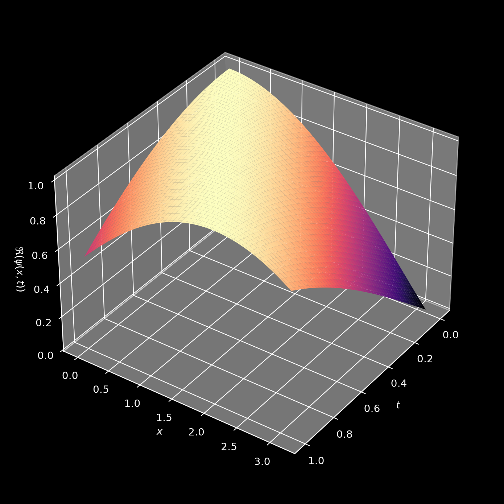

# Solve the linear Schrödinger equation in 1D using a Physics Informed Neural Network



This code heavily draws on the implementation of the PINN approach published by Jan Blechschmidt under https://github.com/janblechschmidt/PDEsByNNs/ (MIT license).


## Explanation
In the following, we will solve the dimensionless 1D Schrödinger equation with inhomogeneous Dirichlet boundary conditions using a Physics Informed Neural Network (PINN).
This boundary values problem can be stated as

$$i \hbar \partial_t \psi(x, t) = \left(-\frac{\hbar^2}{2m}\partial_x^2 + V(x, t)\right) \psi(x, t)$$
with
$$\psi(x, t = t_0) \equiv \psi_0(x) \qquad \psi(x=x_l, t) \equiv \psi_L(t) \qquad \psi(x=x_r, t) \equiv \psi_R(t)$$
for $t \in [t_0, t_1]$ and $x \in [x_l, x_r]$ and $\psi \in C_2([t_0, t_1] \times [x_l, x_r], \mathbb{C})$.

In the first approach considered here - the continuous time approach - we approximate $\psi(x, t)$ via a neural network $\psi_{\theta}(x, t)$ that takes two input parameters and outputs two ouput parameters - the real and imaginary part of the wave function. Note that we approximate the wave function in both spatial and temporal dimensions. In order for the NN to satisfy the boundary value problem, the residual of the PDE

$$r_{\theta}(x, t) \equiv \left(i \hbar \partial_t + \frac{\hbar^2}{2m} \partial_x^2 - V(x, t)\right)\psi_{\theta}(x, t)$$
is included in the loss functional. In total, the loss functional then contains three terms:
 - The mean squared residual
 - The mean squared misfit w.r.t. initial conditions
 - The mean squared misfit w.r.t. boundary conditions

It is minimised over a number of collocation points that are randomly sampled from $[t_0, t_1] \times [x_l, x_r]$.


## Files

| File | Description |
|---|---|
| `schrodinger_pinn_pytorch.py` | **PyTorch implementation** — recommended starting point |
| `linear_schroedinger_1d.ipynb` | Original TensorFlow implementation (continuous time) |
| `linear_schroedinger_1d_discrete_time.ipynb` | Original TensorFlow implementation (discrete time) |

## Performance comparison

Both TensorFlow notebooks solve the same plane wave test problem on $x \in [0, 1]$, $t \in [0, \pi]$ with 5000 Adam iterations and the same learning rate schedule, run on CPU on the same machine.

| | Continuous time | Discrete time |
|---|---|---|
| Training points per iteration | 10000 collocation + 50 initial + 50 boundary | 100 initial + 2 boundary |
| Network outputs | 2 | 2(q+1) = 514 (q = 256 IRK stages) |
| Training time | 398 s | 37 s |
| Final loss | 1.2e-5 | 1.5e-6 |
| L1 error | 0.0006 (random test points in $x$–$t$) | 0.0015 (at $t_1$) |
| Mean density $\lvert\psi\rvert^2$ (exact: 1) | 0.9999 | 0.996 |

The discrete time approach trains about 11 times faster because the IRK scheme replaces the collocation points in time. Note that the L1 errors are evaluated on different points: over the whole domain for the continuous time approach and at the final time $t_1$ for the discrete time approach.

## Setup

### Create the conda environment

```bash
conda env create -f environment.yml
conda activate pinn_env
```

This installs a CPU-only PyTorch build. For GPU support, open `environment.yml`, remove the `cpuonly` line, and add `pytorch-cuda=12.1` (adjust the version to match your CUDA installation), then re-run the command above.

### Register the Jupyter kernel

```bash
python -m ipykernel install --user --name pinn_env --display-name "Python (pinn_env)"
```

### Run the PyTorch notebook

Open `schrodinger_pinn_pytorch.py` in VS Code — the Python extension treats `# %%` cell markers as a Jupyter notebook. Select the `pinn_env` kernel and run cells interactively, or launch JupyterLab:

```bash
jupyter lab schrodinger_pinn_pytorch.py
```
